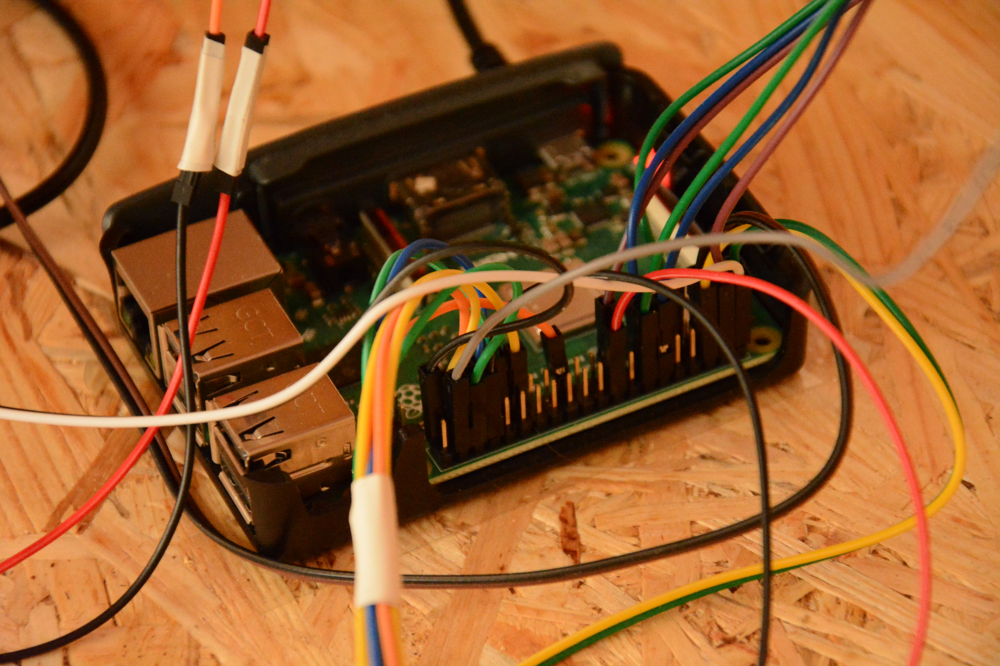
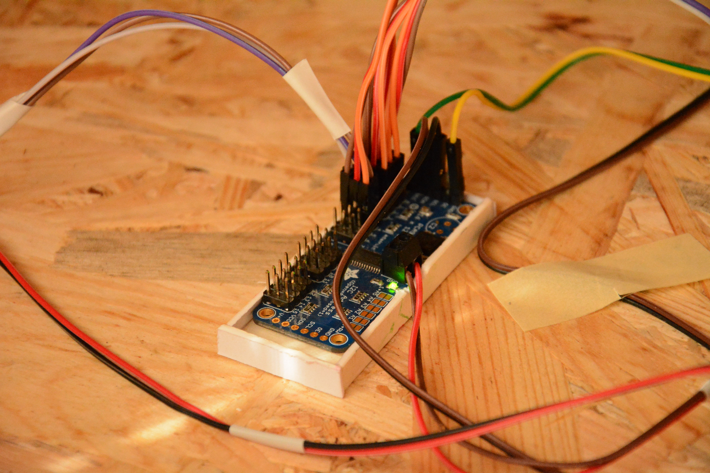
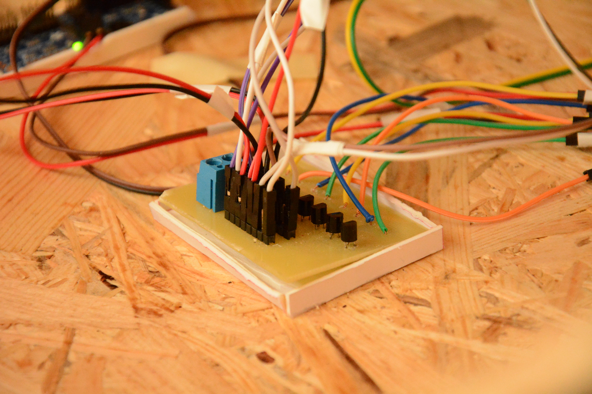

# Smart Home Thesis — Backend

This repository contains the backend implementation for an engineering thesis project focused on smart-home automation.
The backend is built with Node.js and Express, and is designed to run on a Raspberry Pi (or compatible single-board computer) connected to sensors, actuators, and a local MySQL database.

## Year of Completion
2022

## Highlights

- REST API for managing and monitoring sensors and actuators — including temperature, humidity, PIR alarm, buzzer, individual lights, lighting groups, and servo-driven devices (e.g. blinds and gates).
- Optimized for Raspberry Pi, using I²C PWM drivers and GPIO interfaces for direct hardware control.
- Persistent storage handled by MySQL (tables inferred from the code: `Users`, `Sensors`, `Lights`, `Servos`, `Temperature`, `Humidity`).

## Requirements

- Raspberry Pi (or compatible SBC) running Raspberry Pi OS or another Linux distribution.
- Node.js 16+ (check for compatibility with native modules used by hardware drivers).
- MySQL server (local or network). The code expects a MySQL-compatible database.
- I²C interface enabled on Raspberry Pi for PWM/servo communication.

## Environment variables

The application loads environment variables from `config/.env` (see `index.js`). Use that file to store secrets and runtime configuration.
Create `config/.env` with at least these values (names match variables used in the code):

- TOKEN_KEY=your_jwt_secret
- DB_HOST=127.0.0.1
- DB_PORT=3306
- DB_USER=root
- DB_PASS=your_password
- DB_NAME=smart_home
- DB_CONNECTION_LIMIT=10
- SERVER_PORT=3000

The code uses `mysql2`/`mysql2-promise` to connect to MySQL.

## Installation

1. Clone the repository to your Raspberry Pi.
2. Install dependencies:

```pwsh
npm install
```

3. Create the database and tables using the provided `schema.sql` (or adapt it to your needs). Example using mysql client:

```pwsh
mysql -u root -p < schema.sql
```

4. Create `.env` and fill environment variables.
5. Start the server:

```pwsh
npm start
```

During development you can use `npm run dev` (nodemon).

## API — Endpoints (summary)

- Users

  - GET /users/ — list users (id, name, surname, username, email, role)
  - GET /users/:id — get user by id
  - POST /users/sign-up — create new user (body: name, surname, username, email, password, password_confirm, role)
  - POST /users/sign-in — login (body: email, password) — returns JWT token and user info
  - PUT /users/:id — update user
  - DELETE /users/:id — delete user

- Air

  - GET /air/temperature — read current temperature from sensor
  - GET /air/humidity — read current humidity from sensor
  - GET /air/temperature/stats?start=...&end=... — historical temperature records between timestamps
  - GET /air/humidity/stats?start=...&end=... — historical humidity records between timestamps

- Alarm

  - GET /alarm/state — read PIR and Buzzer sensor states
  - PUT /alarm/ — turn alarm on/off (body: { enabled: true/false })

- Light (single sensor)

  - GET /light/state — read light sensor state
  - PUT /light/ — toggle physical light sensor (body: { enabled: true/false })

- Lighting (multiple lights / groups)

  - GET /lighting/state — list lights (name, state, location)
  - PUT /lighting/ — set single light state (body: { name, state })
  - PUT /lighting/outside — set all outside lights (body: { enabled: true/false })
  - PUT /lighting/inside — set all inside lights (body: { enabled: true/false })

- Servo (blinds/gates)
  - GET /servo/state — list servos (name, address, state)
  - PUT /servo/ — set servo state (body: { name, address, state })

Note: Some endpoints interact with physical devices — calls to device modules will have side effects on GPIO/I2C.

## Wiring & Photos





## Development notes & assumptions

- If anything in the actual hardware wiring or configuration differs from the assumptions in the code, prefer the real wiring/PCB and update the device modules accordingly.

## Inferred Database Schema

See `schema.sql` for the CREATE TABLE statements inferred from the code. Create the schema before starting the app.
